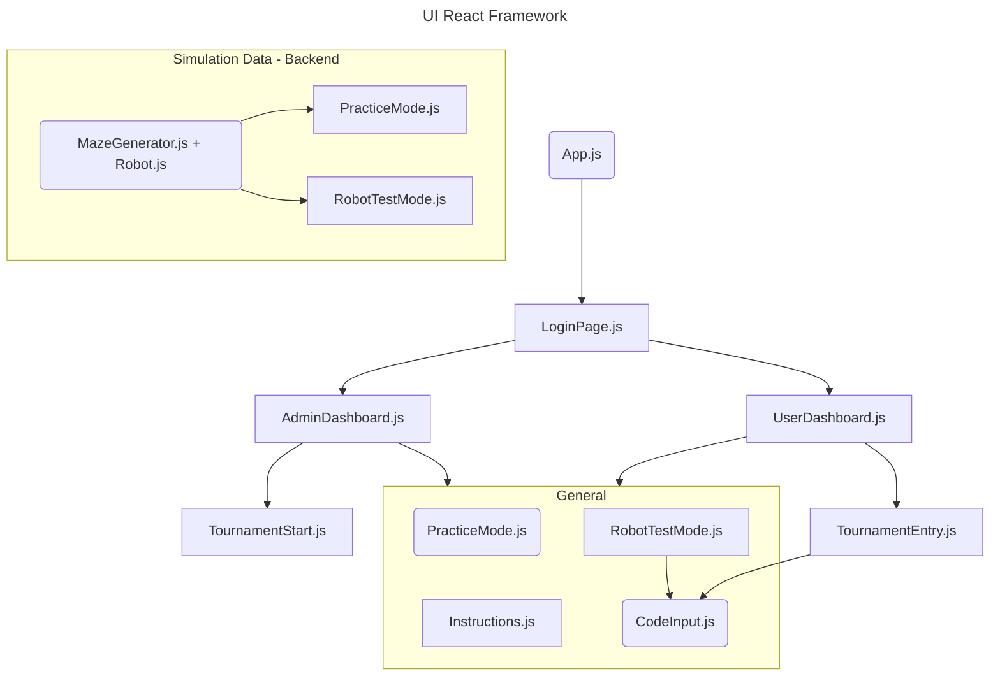
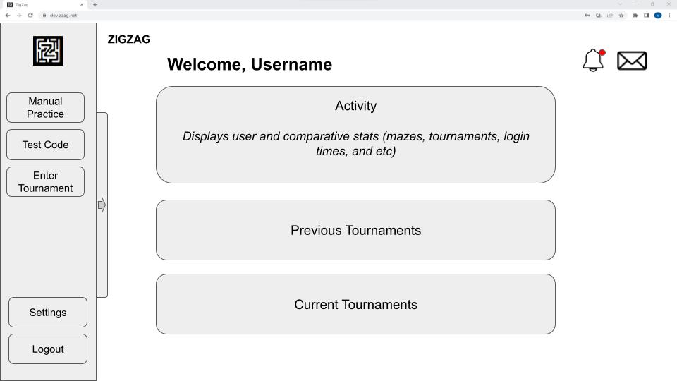
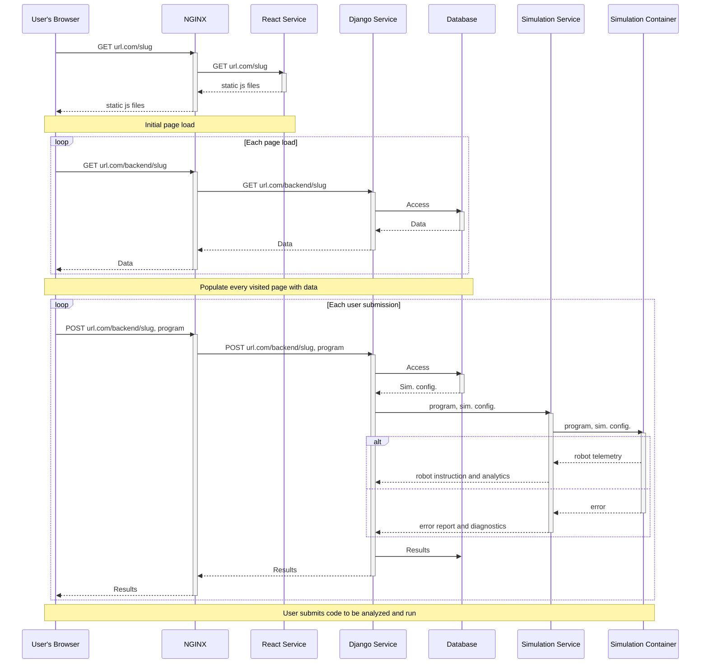
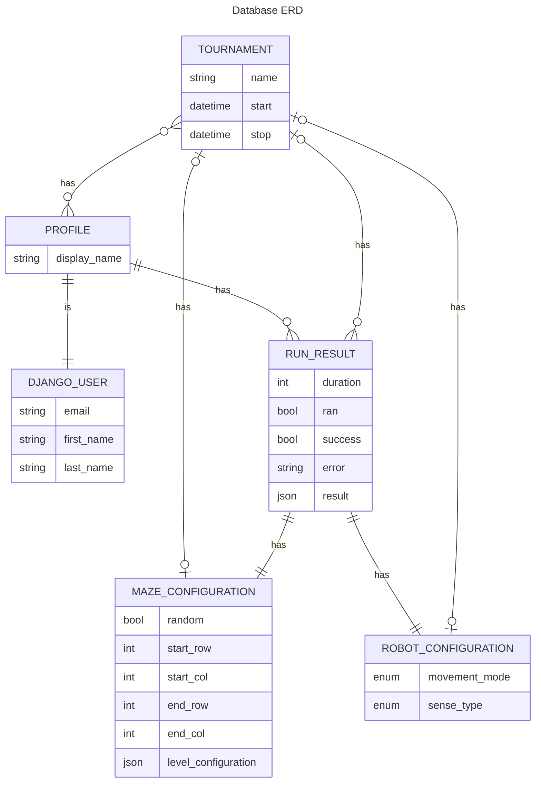

**WARNING:** this document is in the process of being transferred from google docs to this repository. This process is not complete and some items are missing from this version.

# Requirements and Specification Document

## ZigZag

*2023/10/09*, version 1.1

### Project Abstract

This application will function as a maze-solving programming challenge where users will be challenged to write Java code to help a simulated robot escape a maze. Their attempts will be qualified based on the amount of moves, including turning, moving, and sensing, as well as the overall runtime of their solution. Users will be able to compare their attempts with other users and even compete to complete specialized challenges as efficiently as possible. The app will not only allow users to practice their Java coding capabilities but also refine their skills and learn new ways of implementing an algorithm for escape in different versions of the maze.

### Document Revision History

Rev. 1.0 <2023-10-03>: initial version

Rev. 1.1 <2023-10-09>: end of sprint 0

### Customer

<!--A brief description of the customer for this software, both in general (the population who might eventually use such a system) and specifically for this document (the customer(s) who informed this document). Some projects have external customers, and every project will have a customer from the CS506 instructional staff. Requirements should not be derived simply from discussion among team members. Ideally your customer should not only talk to you about requirements but also be excited later in the semester to use the system.-->

The customers for this application generally, are people who want to get hands-on experience with Java in an environment that is not only education oriented but also integrates resources for testing and implementing that make programming fun and informative. Anyone who wants to learn, practice, or put their skills to the test will be able to use this application in order to gauge their own expertise and progress as well as engage in a community of users who are oriented towards the same goal. 

In particular, this product helps users interested in robotics programming learn the basics of java programming (and hardware programming). This includes those who want to learn to develop pathfinding algorithms, learn to implement simple sensor data in programming, and/or understand how code can interact with the real world, via a simulated environment.

### User Requirements

- As a user, I want to log into the app using a username and password so that I can access the features available to my account.
  - As a user, I want to be able to use my google account to log into the app
- As a user, I want to be able to access my past maze challenges and all associated attempts
- As a user, I want to be able to use the graphical user interface (GUI) to select the operating mode.
  - As a user, I want to be able to tell the difference between which operating mode I am in visually
    - Color Schemes
- As a user, I want to be able to use the GUI to enter an "Instructions" view, which will explain the rules of the programming challenge.
- As a user, I want to be able to enter a "Practice" mode where I can use my keyboard to manually move a simulated robot through a randomly-selected 2D maze so that I can better understand how the robot moves.
  - As a user, I want to be able to navigate between “Practice” and test mode seamlessly without losing my progress in either
- As a user, I want to be able to use the GUI to enter a "Robot Test" mode, which will allow me to submit my robot code for testing.
  - As a user, I want the option of either copy pasting my code into a prompt or dragging and dropping/selecting a specific file for testing
- As a user, I want the "Robot Test" mode to give me an informative error through the GUI if there are problems with my robot code.
  - As a user I want to be able to access information about how to fix my errors or common edge case scenarios that are associated with its occurrence
- As a user, while in the "Robot Test" mode, I want to be able to test my robot code and see how my code affects the robot's behavior in the maze.
  - As a user, I want to watch my code’s execution in real time to address behaviors and monitor breaking points
    - As a user, I want to set the speed at which my code simulates the robot through the maze
  - As a user, I want to be able to manually step through my code and watch as the robot moves through the maze accordingly
- As a user, after testing my robot code in "Robot Test" mode, I want to be able to see how many moves my robot made in its attempt to solve the maze.
  - As a user, I want my code to be qualified according to **[insert metrics]** and be able to compare its performance
  - As a user, I want to be able to see how my code performs compared to other users by different metrics
- As a user, I want to be able to use the GUI to enter a "Tournament" mode which will allow me to submit my robot code in a competition against other students.
  - As a user, I want to be able to invite other users to a one on one programming battle where we race to finish the maze
- As an admin, I want to be able to start the "Tournament" after all the competitors have made their submissions.
  - As an admin, I want to be able to start the “Tournament” evaluation after an active countdown which signals the submission deadline
- As an admin, I want to be able to add and remove mazes from the set included in the programming challenge.
  - As an admin, I want to be able to add and remove users from the programming challenge

### Use Cases

<!--Use cases that support the user requirements in the previous section. These use cases should be based off user stories. Every major scenario should be represented by a use case, and every use case should say something not already illustrated by the other use cases. Diagrams (such as sequence charts) are encouraged. Ask the customer what are the most important use cases to implement by the deadline. You can have a total ordering, or mark use cases with “must have,” “useful,” or “optional.” For each use case you may list one or more concrete acceptance tests (concrete scenarios that the customer will try to see if the use case is implemented).-->

Here is an example chart for a single use case:

| Name            | Register                                                     |
| --------------- | ------------------------------------------------------------ |
| Actors          | Student                                                      |
| Triggers        | Clicking on register button                                  |
| Events          | Students enter their first, middle, last name, email (which will serve as their username), and password. |
| Exit Conditions | Required information is entered correctly.                   |
| Post-conditions | The student is able to login with the entered information.   |
| Acceptance Test | The passwords satisfy complexity requirements, the emails are formatted properly, the new user exists in the database. |

### User Interface Requirements

<!--Describes any customer user interface requirements including graphical user interface requirements as well as data exchange format requirements. This also should include necessary reporting and other forms of human readable input and output. This should focus on how the feature or product and user interact to create the desired workflow. Describing your intended interface as “easy” or “intuitive” will get you nowhere unless it is accompanied by details.-->

<!--NOTE: Please include illustrations or screenshots of what your user interface would look like -- even if they’re rough -- and interleave it with your description.-->

### Security Requirements

<!--Discuss what security requirements are necessary and why. Are there privacy or confidentiality issues? Is your system vulnerable to denial-of-service attacks?-->

Running user-submitted code is a substantial security issue with this kind of product. In order to maintain the integrity of our system and protect user data, we have to ensure that all user-submitted code is run in a safe, sandboxed environment where malicious actors will be unable to perform any harmful actions. To do this we will simulate all program submissions in a secure environment using docker.

Additionally, while not a focus of our product, in order to protect user data we also need a login portal to provide controlled access to user data.

### System Requirements

<!--List here all of the external entities, other than users, on which your system will depend. For example, if your system inter-operates with sendmail, or if you will depend on Apache for the web server, or if you must target both Unix and Windows, list those requirements here. List also memory requirements, performance/speed requirements, data capacity requirements, if applicable.-->

Our system requires a linux system with docker and NGINX installed. While not super resource intensive, it is recommended that the base system has a moderately recent CPU and at least 8GB of memory installed.

### Specification

<!--A detailed specification of the system. UML, or other diagrams, such as finite automata, or other appropriate specification formalisms, are encouraged over natural language.-->

<!--Include sections, for example, illustrating the database architecture (with, for example, an ERD). See the examples in the example Requirements and Specifications document posted on the Canvas (in an announcement)-->

#### Architecture

The architecture for our product can be split into three overarching categories, which loosely relate to the three components of the traditional MVC architecture. Within these categories the product is split up into a number of smaller services in the style of a microservice architecture design.

The Model component of our product consists of the **Simulation Service**, and **Database Service**. The **Simulation Service** receives java code and arranges for a simulation container to run the submitted code. It also receives a randomly generated 2D array of binary values to represent the maze. The **Simulation Service** then constructs a maze framework using the 2D array representation through which the simulated robot can interact using the user submitted code, returning information about the code such as any errors, timing information, and the robot’s path. The **Database Service** stores information about users, tournaments, robots, mazes, and any other required persistent data for the product.

The View component of our product primarily consists of a **React Frontend** which is served from a separate static site server which only serves the required front-end files for the user’s browser. For the purposes of this document, the **React Frontend** refers to the react code itself (i.e. the code that runs in the user’s browser), not the **React Service** that statically serves the react files to the user.

The Controller component consists of the **Django Backend Service** and the **NGINX Service** (which runs locally on the host machine). The controller component is responsible for directing requests to the correct locations and acts as an interface for all other services to communicate with. The **NGINX Service** is a reverse proxy which routes requests to the correct service inside the host system. The **Django Backend Service** manages communications between the View services and the Model services.

The technology stack can be viewed in the following diagram. In the diagram the **React Service** is not pictured, since it is implied by the inclusion of the **React Frontend**.

While there are a number of different functions that the entire product supports, the primary function of the product is the ability of the user to submit code and see the robot perform the results. A simplified version of how the system carries out that main function can be seen in the following sequence diagram.

In the diagram, you can see that the user submits a program, the **Backend Service** retrieves information from the **Database Service**, then sends information to the **Simulation Service**, which in turn creates a simulation container, and then the results are returned all the way back to the **React Frontend**.

<!--Note: please remove template section descriptions before submitting!-->

#### Database

The following diagram describes the basic relationships found in our database. All database objects have dedicated primary keys managed by Django, so are not listed in the diagram.

